NARMS qPCR design: multilevel occupancy
================
Roy Martin
March 05, 2025

# 1 Background and model

For this scenario, imagine that we are looking to estimate the
prevalence of a specific gene variant for 30 sites, visited once every
three weeks for 17 weeks (roughly 1 year). So we have

roughly equally-spaced points in time for which we intend to estimate
the state of occupancy for each of the

sites. For our water sampling method, we’re also going to utilize

replicate grab samples from a site on each visit; so we’d have to use

water bottles over the course of the study for a single site in this
scenario. Then, we’d conduct

replicate qPCR runs per each of the water samples grabbed. Lets say
we’re going to do

replicate qPCR analyses for each water sample
,
where maybe we divide each, say, 500 mL sample equally among

125 mL samples for filtering and extraction. To summarize, we’d have 4
qPCR replicates, nested in each of 5 replicate water samples, which are
nested in each of 17 days for each of 30 sampling sites. So, our

as summed across the observation level (qPCR reps) is
.
This is a huge

and maybe unfeasible, but it is a place to start for illustrating the
model and getting a general feel for some of the inherent sources of
uncertainty in this type of study.

Next, we’ll use these hypothetical data dimensions to simulate a fake
dataset using a multilevel occupancy model as described in ([Schmidt et
al. 2013](#ref-Schmidt_etal_2013)) and earlier by ([Nichols et al.
2008](#ref-Nichols_etal_2008)). At first, we will ignore any
hypothetical covariates (e.g., stream size, land use, measured water
chemistry), but they can easily be included in the model later. The
basic model below consists of a sequence of three coupled Bernoulli
trials for describing the array of nested data,
,
where we have an observed detection
()
or not
()
for each PCR replicate
,
nested in a water sample
,
nested in a sample visit day

at a site
.
If we plan to completely cross site and day, we would have

total sampling occasions.

The model can be described in mathematical notation:

")

")

")

Here,

represents a latent random variable defining the
,
meaning the presence
()
or absence
()
of target DNA in the sampling area of a site

at time
.
In our hypothetical, we’re assuming this snapshot (within a day) visit
is capable of inferring the

state for that site and day. The latent state

is assumed Bernoulli distributed and is a function of the

parameter
.

The next random variable down the hierarchy,
,
is also dependent on
,
and described as the
.
It defines whether or not there is DNA in a water sample

from site

and time

that would available for detection via qPCR. If the site is occupied on
that sampling visit (i.e,
)
with DNA at some concentration, then

is determined by a Bernoulli trial and according to the parameter
,
or the
.

could also be described as the probability of capturing observable DNA
in a water sample, conditional on the site being occupied. If

then

would necessarily be
,
as it would be sampled from a Bernoulli distribution with
.

The third random variable

is the four-dimensional array containing the observed detects

recorded at the level of the qPCR replicate. These observed states are
also dependent on the latent availability state,
,
in the way that

is dependent on
.
If
,
then

is necessarily zero. Likewise, if
,
then
.
If
,
the qPCR observations (binary according to cycle threshold) are assumed
Bernoulli distributed according the the parameter
,
which is the

for qPCR rep
,
from water sample
,
in site
,
on day
.
The

could also be described as the probability of detecting DNA via qPCR
given that it is available in the water sample.

Ultimately, we have three types of parameters,
,
,
and
,
which we would like to estimate by conditioning on the observations,
,
using fully Bayesian methods. Again, these are the probability of
occupancy, the probability of availability (given occupied), and the
probability of detection via PCR (given availability). The glaring
assumption of this model is that there are no false positives. This is
maybe a reasonable assumption for qPCR in terms of the measurement
instrument itself working faithfully. It is maybe a reasonable
assumption for the laboratory practice, where we would need to assume no
or very little contamination or cross-reactivity. Outside the
laboratory, false positives can arise in the field due to contamination
during sampling, travel, or transfer. So, aside from building a
different model that relaxes this important assumption, one would need
to closely monitor for contamination in the lab, field, and transport
(e.g., blanks, etc) in order to quantify and minimize the chance for
false positives.

``` r
#knitr::opts_chunk$set(include = FALSE)
# Lets now set up our R environment to run the simulation.
library(ggplot2)
library(ggExtra)
library(gridExtra)
library(RColorBrewer)
library(truncnorm)
library(stringr)
library(tidyverse)
library(rstan)
library(loo)
library(bayesplot)
library(tidybayes)

options(mc.cores = 16)
rstan_options(auto_write = TRUE)
options(loo.cores = 16)

options(max.print = 9999)
```

# 2 Prior predictive simulation

Next, we’ll run some simulations from this model using our beliefs about
the values of the parameters
,
,
and
.
We’re taking a Bayesian perspective, so we are going to assign each
parameter a probability distribution that reflects these prior beliefs.
After we settle on these priors, we can then do a “push forward” of our
model, which will effectively simulate draws from the *prior predictive
distribution*.

## 2.1 Set up conditions

Lets first set up our hypothetical data dimensions in terms of the
number of dates, water samples, pcr replicates, and simulations.

``` r
nsite <- 30 # number of sites in study
ntime <- 17 # number of dates in study
nsamp <- 5 # number of replicate water samples per site
nrep <- 4 # number of replicate qPCR samples per water sample (per site and date)
nsim <- 1e3 # number of simulated draws from joint prior predictive distribution
```

So, we’re going to sample 30 sites on 17 consecutive days. We’re going
to take 5 water samples on each of those days for each site; and we’re
going to split each of those water samples into 4 PCR replicates.
Finally, we’re going to simulate 1000 draws from the prior predictive
distribution.

Now we need to set up ‘containers’ for the simulation. That is, make
some objects in R for storing for the simulated values of
,
,
,
etc. Note that these containers all have one more dimension than
mentioned in the model description above. The added dimension is for
holding the simulated draws from the prior predictive distribution. In
this case, that last dimension will always be of size = 1000, which is
the number of draws we decided (above) to use for our simulation. This
number could just as well be

or something otherwise huge, but anything over a few hundred should be
fine for the purposes of getting an understanding the statistical
properties of the posterior.

``` r
# make an array placeholder for siumation, s, of the latent occupancy state, z, for each site, i
z_it <- array(NA, dim = c(nsite, ntime, nsim))

# make an array placeholder for latent availability state, a, for water rep, j, in site i
a_ijt <- array(NA, dim = c(nsite, nsamp, ntime, nsim))

# make an array placeholder for simulation, s, of oserved detections, y, for each pcr rep, k, in water sample, j, and site i
y_ijkt <- array(NA, dim = c(nsite, nsamp, nrep, ntime, nsim))

# make an array placeholder for simulation, s, of the paramter psi or P( site occupied )
psi_it <- array(NA, dim = c(nsite, ntime, nsim))

# make an array placeholder for simulation, s, of the parameter theta or P( available in water sample | site occupied )
theta_ijt <- array(NA, dim = c(nsite, nsamp, ntime, nsim))

# make an array placeholder for simulation, s, of the paramter p or P( detect in PCR rep | available in water sample )
p_ijkt <- array(NA, dim = c(nsite, nsamp, nrep, ntime, nsim))
```

## 2.2 Models for , , and 

In the following, we’ll choose priors for
,
,
and
.

### 2.2.1 

Our indexing in the introduction indicates that we’ve left room for
extending the models for the parameters with additional linear
structure. In this case, we’re going to employ a linear predictor for
each parameter with a logit link function. Our model for
,
will be:

 = \alpha_\psi + \gamma_{\psi_i} + \delta_{\psi_t} + \nu_{\psi_{i,t}}")

where

is just the intercept for the linear predictor of

on the log-odds scale. The intercept parameter
,
is back-transformed to the probability scale via the inverse-logit
function. So, equivalently:

 }")

In this parameterization,

determines the average probability of occupancy across sites and time;
and
,
,
and

are varying effects, centered on zero, that determine deviations around
the intercept parameter according to site- and date-specific effects,
and their interaction, respectively. These varying effects further
paremeterized where:

")

")

")

The standard deviation terms
,
"),
and
")
determine the extent of variation around zero for each of the varying
effects; and are conditioned on the observed data.

We must choose priors for all of the parameters to be conditioned on the
observed data, including
,
,
"),
and
").
For the intercept parameter, we choose a normal prior, where:

")

This is to say that our prior for this intercept parameter is “normally
distributed with location =
,
and scale =
”.
With regard to location, recall that

would correspond to
 =0.5")
on the probability scale. So if our normal prior is centered such that
,
we’re thinking that the most likely true value for

is 0.5. Practically, this would suggest that we think that our sampling
sites are occupied with the target DNA for 50% or half of all the
site-day combinations. The intercept is a bit hard to conceptualize in
this context because it requires placing a prior over all the sites and
times, when there is likely a good bit of heterogeneity across those
dimensions. To further flesh out our prior, nevertheless, we’d want to
think about how certain we are about that location and adjust

accordingly. In practice, this process of choosing useful priors should
be done carefully and critically, employing as much domain expertise as
possible, in order to learn as much as possible from the data/study.

Lets now choose the priors for the intercept parameter, which requires
choices for

and
.
Then we can simulate the 1000 draws from this prior.

``` r
# prior for log-odds-scale intercept parameter for psi
loc_a_psi = 0
scale_a_psi = 1.5
a_psi <- rnorm(nsim, loc_a_psi, scale_a_psi)
```

So, we’ve chosen

and
.
Therefore, our prior is centered over

on the log-odds scale, or
 = 0.5")
on the probability scale. Along with the scale we’ve chosen, this prior
places 90% of the density of

between about -2.467 and -2.467 on the log-odds scale, or 0.078 and
0.922 on the probability scale. Here’s a vizualization of the prior on
the log-odds scale.

``` r
# plot it
ggplot(tibble( x = seq(- 10, 10, 0.01), y = dnorm(seq(- 10, 10, 0.01), loc_a_psi, scale_a_psi)), 
        aes(x = x, y = y)) + 
  geom_line() + 
  ylab("density") + xlab(expression( alpha[psi]))
```

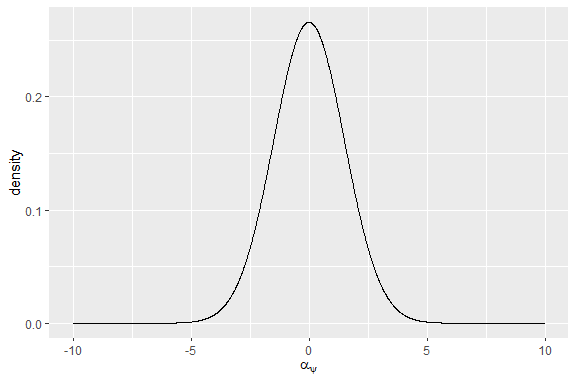

And on the probability scale.

``` r
# plot it
ggplot(tibble(x = plogis(seq(- 10, 10, 0.01)), y = dnorm(seq(- 10, 10, 0.01), loc_a_psi, scale_a_psi)), 
        aes(x = x, y = y )) + 
  geom_line() + 
  ylab("density") + xlab(expression(paste(logit^-1, (alpha[psi]))))
```

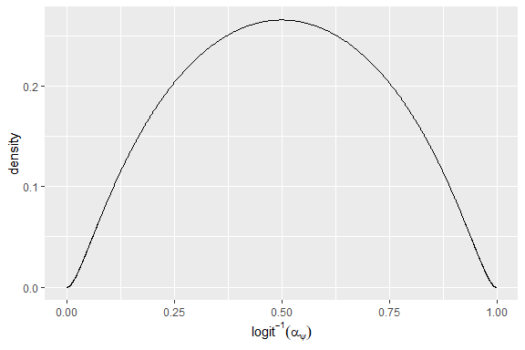

And, finally, here are our simulated draws for this prior on the
probability scale.

``` r
# plot it
ggplot(tibble(x = plogis(a_psi)), 
        aes(x = x)) + 
  geom_histogram(binwidth = 0.05) + 
  ylab("number of draws from prior") + xlab(expression(paste(logit ^ -1,  (alpha[psi])))) +
  scale_x_continuous(limits = c(0, 1))
```

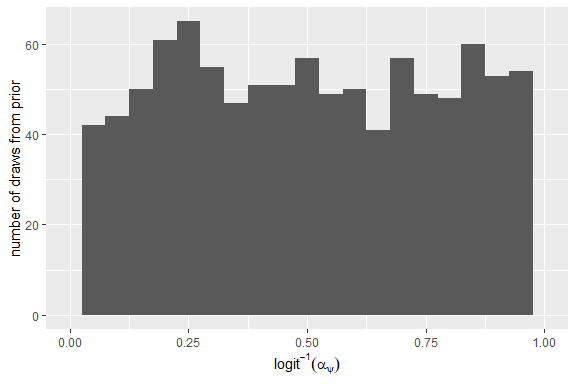
Next, we’ll choose the priors standard deviation parameters for the
varying effects. For these standard deviation parameters, the values
must be non-zero. We use half-normal priors, which again require a
choice of location and scale.

First, the prior for
,
which is the parameter determining the amount of site to site variation
in
.
Again, this variation is implemented in the model structure above as
variation around the mean probability of occupancy,
.

``` r
# prior for scale parameter of varying site effects
loc_sigma_gamma_psi = 0
scale_sigma_gamma_psi = 0.5
sigma_gamma_psi <- rtruncnorm(nsim, a = 0, mean = loc_sigma_gamma_psi, sd = scale_sigma_gamma_psi)
```

We’ve chosen the location parameter for the prior on

to be

and the scale parameter to be
.
Therefore, our prior is centered over
.
Along with the scale we’ve chosen, this prior places 90% of the density
of this standard deviation parameter between about 0.031 and 0.98. Below
is a visualization of the prior.

``` r
# plot it
ggplot(tibble(x = seq(0, 2, 0.01), 
              y = dtruncnorm(seq(0, 2, 0.01), 
                             a = 0, 
                             mean = loc_sigma_gamma_psi, 
                             sd = scale_sigma_gamma_psi)), 
        aes(x = x, y = y)) + 
  geom_line() + 
  ylab("density") + xlab(expression(sigma[gamma[psi]]))
```

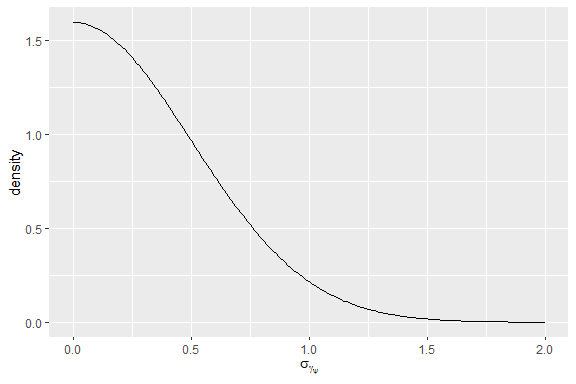

Here are our simulated draws for this prior on the probability scale.

``` r
# plot it
ggplot(tibble(x = sigma_gamma_psi), 
        aes(x = x)) + 
  geom_histogram(binwidth = 0.05) + 
  ylab("number of draws from prior") + xlab(expression(sigma[gamma[psi]])) +
  scale_x_continuous( limits = c( 0, 2 ) )
```

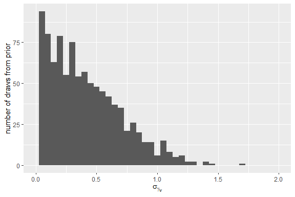
Next, the prior for
,
the parameter controlling the amount of day to day variation.

``` r
# prior for scale parameter of varying site effects
loc_sigma_delta_psi = 0
scale_sigma_delta_psi = 0.5
sigma_delta_psi <- rtruncnorm(nsim, a = 0, mean = loc_sigma_delta_psi, sd = scale_sigma_delta_psi)
```

We’ve chosen the location parameter for the prior on

to be

and the scale parameter to be
.
Our prior places most of the probability over
.
Along with the scale we’ve chosen, this prior places 90% of the density
of this standard deviation parameter between about 0.031 and 0.98. Below
is a visualization of the prior.

``` r
# plot it
ggplot(tibble(x = seq(0, 2, 0.01), 
              y = dtruncnorm(seq(0, 2, 0.01), 
                             a = 0, 
                             mean = loc_sigma_delta_psi, 
                             sd = scale_sigma_delta_psi)), 
        aes(x = x, y = y)) + 
  geom_line() + 
  ylab("density") + xlab(expression(sigma[delta[psi]]))
```

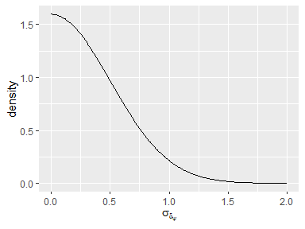

Here are our simulated draws for this prior on the probability scale.

``` r
# plot it
ggplot(tibble(x = sigma_delta_psi), 
        aes(x = x)) + 
  geom_histogram(binwidth = 0.05) + 
  ylab("number of draws from prior") + xlab(expression(sigma[delta[psi]])) +
  scale_x_continuous(limits = c( 0, 2 ))
```

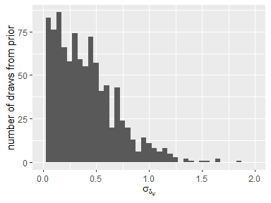
The last parameter that needs a prior for the

portion of the model is
,
which is the parameter controlling the amount of variation in the
interaction between the site and day effects. This effectively
determines how much between-site variation there is in day to day
variability. The all-encompassing term might be “spatio-temporal”
variation.

``` r
# prior for scale parameter of varying site effects
loc_sigma_nu_psi = 0
scale_sigma_nu_psi = 0.25
sigma_nu_psi <- rtruncnorm(nsim, a = 0, mean = loc_sigma_nu_psi, sd = scale_sigma_nu_psi)
```

We’ve chosen the location parameter for the prior on

to be

and the scale parameter to be
.
Our prior places most of the probability over
.
Along with the scale we’ve chosen, this prior places 90% of the density
of this standard deviation parameter between about 0.016 and 0.49. Below
is a visualization of the prior.

``` r
# plot it
ggplot(tibble(x = seq(0, 2, 0.01), 
              y = dtruncnorm(seq(0, 2, 0.01), 
                             a = 0, 
                             mean = loc_sigma_nu_psi, 
                             sd = scale_sigma_nu_psi)), 
        aes(x = x, y = y)) + 
  geom_line() + 
  ylab("density") + xlab(expression(sigma[nu[psi]]))
```

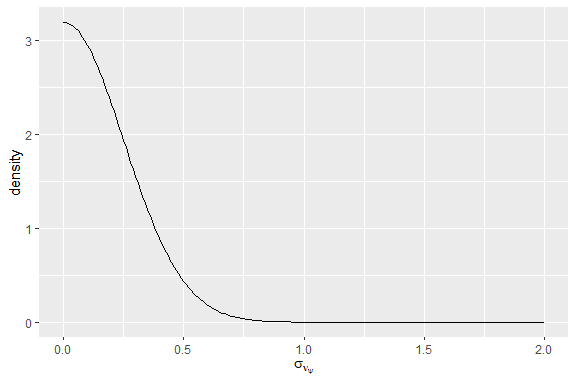

Here are our simulated draws for this prior on the probability scale.

``` r
# plot it
ggplot(tibble(x = sigma_nu_psi), 
        aes(x = x)) + 
  geom_histogram(binwidth = 0.05) + 
  ylab("number of draws from prior") + xlab(expression(sigma[nu[psi]])) +
  scale_x_continuous(limits = c(0, 2))
```

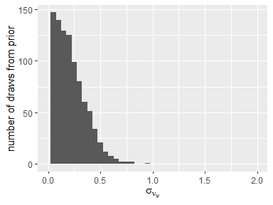

### 2.2.2 

Now lets run through the same process for
,
the availability probability. Again, we’ll use the logit-link linear
predictor with the intercept parameter, where:

 = \alpha_\theta + \gamma_{\theta_i} + \delta_{\theta_t} + \nu_{\theta_{i,t}}")

We, again, further describe the varying effects as:

")

")

")

So, well choose prior values for

and
.

``` r
# prior for log-odds-scale intercept parameter for psi
loc_a_theta = -0.5
scale_a_theta = 0.5
a_theta <- rnorm(nsim, loc_a_theta, scale_a_theta)
```

We’ve chosen

and
.
Therefore, our prior is centered over

on the log-odds scale, or
 = 0.378")
on the probability scale. This prior places 90% of the density of

between about -1.322 and -1.322 on the log-odds scale, or 0.21 and 0.58
on the probability scale. Here’s a visualization of the prior on the
log-odds scale.

``` r
# plot it
ggplot(tibble(x = seq(- 10, 10, 0.01), y = dnorm(seq(- 10, 10, 0.01), loc_a_theta, scale_a_theta)), 
        aes(x = x, y = y)) + 
  geom_line() + 
  ylab("density") + xlab(expression(alpha[theta]))
```

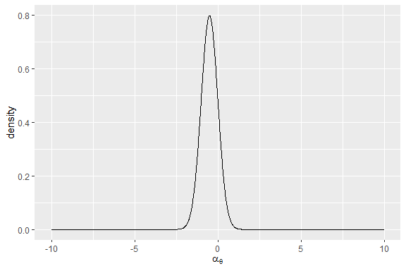

On the probability scale.

``` r
# plot it
ggplot( tibble( x = plogis(seq(- 10, 10, 0.01)), y = dnorm(seq(- 10, 10, 0.01), loc_a_theta, scale_a_theta)), 
        aes(x = x, y = y)) + 
  geom_line() + 
  ylab("density") + xlab(expression(paste(logit^-1,  (alpha[theta])))) +
  scale_x_continuous(limits = c(0, 1))
```

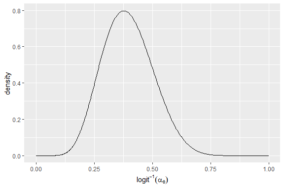

And, finally, our simulated draws from this prior on the probability
scale.

``` r
# plot it
ggplot(tibble(x = plogis(a_theta)), 
        aes(x = x)) + 
  geom_histogram(binwidth = 0.05) + 
  ylab("number of draws from prior") + xlab(expression(paste(logit ^ -1, (alpha[theta])))) +
  scale_x_continuous( limits = c( 0, 1 ) )
```

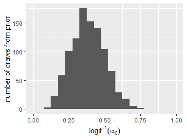

The prior for
,
which is the parameter determining the amount of site to site variation
in
.

``` r
# prior for scale parameter of varying site effects
loc_sigma_gamma_theta = 0
scale_sigma_gamma_theta = 0.25
sigma_gamma_theta <- rtruncnorm(nsim, a = 0, mean = loc_sigma_gamma_theta, sd = scale_sigma_gamma_theta)
```

We’ve chosen the location parameter for the prior on

to be

and the scale parameter to be
.
Therefore, our prior is centered over
.
Along with the scale we’ve chosen, this prior places 90% of the density
of this standard deviation parameter between about 0.016 and 0.49. Below
is a visualization of the prior.

``` r
# plot it
ggplot(tibble(x = seq(0, 2, 0.01), 
              y = dtruncnorm(seq(0, 2, 0.01), 
                             a = 0, 
                             mean = loc_sigma_gamma_theta, 
                             sd = scale_sigma_gamma_theta)), 
        aes(x = x, y = y)) + 
  geom_line() + 
  ylab("density") + xlab(expression(sigma[gamma[theta]]))
```

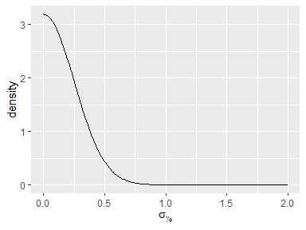

Here are our simulated draws for this prior on the probability scale.

``` r
# plot it
ggplot(tibble(x = sigma_gamma_theta), 
        aes(x = x)) + 
  geom_histogram(binwidth = 0.05) + 
  ylab("number of draws from prior") + xlab(expression(sigma[gamma[theta]])) +
  scale_x_continuous(limits = c(0, 2))
```

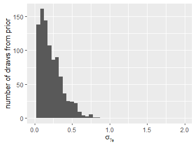
Next, the prior for
,
the parameter controlling the amount of day to day variation.

``` r
# prior for scale parameter of varying site effects
loc_sigma_delta_theta = 0
scale_sigma_delta_theta = 0.25
sigma_delta_theta <- rtruncnorm(nsim, a = 0, mean = loc_sigma_delta_theta, sd = scale_sigma_delta_theta)
```

We’ve chosen the location parameter for the prior on

to be

and the scale parameter to be
.
Our prior places most of the probability over
.
Along with the scale we’ve chosen, this prior places 90% of the density
of this standard deviation parameter between about 0.016 and 0.49. Below
is a visualization of the prior.

``` r
# plot it
ggplot(tibble(x = seq(0, 2, 0.01), 
              y = dtruncnorm(seq(0, 2, 0.01), 
                             a = 0, 
                             mean = loc_sigma_delta_theta, 
                             sd = scale_sigma_delta_theta)), 
        aes(x = x, y = y)) + 
  geom_line() + 
  ylab("density") + xlab(expression(sigma[delta[theta]]))
```

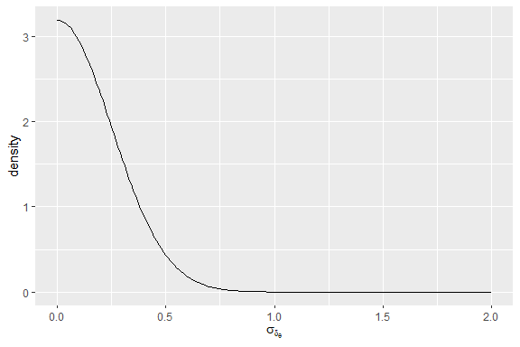

Here are our simulated draws for this prior on the probability scale.

``` r
# plot it
ggplot(tibble(x = sigma_delta_theta), 
        aes(x = x)) + 
  geom_histogram(binwidth = 0.05) + 
  ylab("number of draws from prior") + xlab(expression(sigma[delta[theta]])) +
  scale_x_continuous(limits = c(0, 2))
```

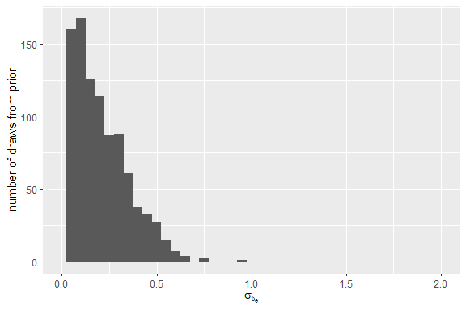
The last parameter that needs a prior for the

portion of the model is
,
which is the parameter controlling the amount of “spatio-temporal”
variation.

``` r
# prior for scale parameter of varying site effects
loc_sigma_nu_theta = 0
scale_sigma_nu_theta = 0.10
sigma_nu_theta <- rtruncnorm(nsim, a = 0, mean = loc_sigma_nu_theta, sd = scale_sigma_nu_theta)
```

We’ve chosen the location parameter for the prior on

to be

and the scale parameter to be
.
Our prior places most of the probability over
.
Along with the scale we’ve chosen, this prior places 90% of the density
of this standard deviation parameter between about 0.006 and 0.196.
Below is a visualization of the prior.

``` r
# plot it
ggplot(tibble(x = seq(0, 2, 0.01), 
              y = dtruncnorm(seq(0, 2, 0.01), 
                             a = 0, 
                             mean = loc_sigma_nu_theta, 
                             sd = scale_sigma_nu_theta)), 
        aes(x = x, y = y)) + 
  geom_line() + 
  ylab("density") + xlab(expression(sigma[nu[theta]]))
```

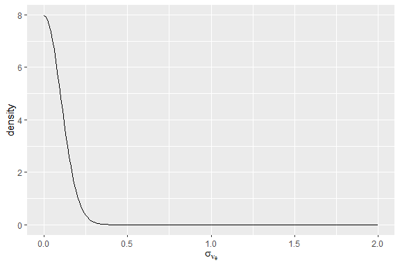

Here are our simulated draws for this prior on the probability scale.

``` r
# plot it
ggplot(tibble(x = sigma_nu_theta), 
        aes(x = x)) + 
  geom_histogram(binwidth = 0.05) + 
  ylab("number of draws from prior") + xlab(expression(sigma[nu[theta]])) +
  scale_x_continuous(limits = c(0, 2))
```

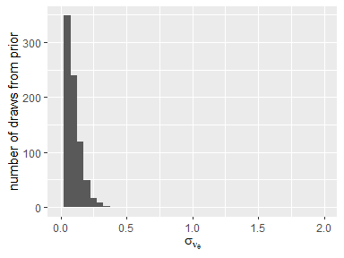

### 2.2.3 

Finally, lets look at priors for
.
Again, we’ll use the logit-link linear predictor and an intercept-only
model with the intercept parameter
,
where:

 = \alpha_p + \gamma_{p_i} + \delta_{p_t} + \nu_{p_{i,t}}")

We, again, further describe the varying effects as:

")

")

")

Next, choose prior values for

and
.

``` r
# prior for log-odds-scale intercept parameter for p
loc_a_p = 2
scale_a_p = 1
a_p <- rnorm(nsim, loc_a_p, scale_a_p)
```

We’ve chosen

and
.
Therefore, our prior is centered over

on the log-odds scale, or
 = 0.881")
on the probability scale. This prior places 90% of the density of

between about 0.355 and 0.355 on the log-odds scale, or 0.588 and 0.975
on the probability scale. Here’s a vizualization of the prior on the
log-odds scale.

``` r
# plot it
ggplot(tibble(x = seq(- 10, 10, 0.01), y = dnorm(seq(- 10, 10, 0.01), loc_a_p, scale_a_p)), 
        aes(x = x, y = y )) + 
  geom_line() + 
  ylab("density") + xlab(expression(alpha[p]))
```

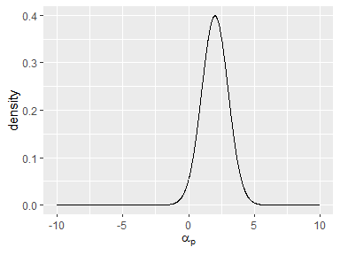

On the probability scale.

``` r
# plot it
ggplot(tibble(x = plogis(seq(- 10, 10, 0.01)), y = dnorm(seq(- 10, 10, 0.01), loc_a_p, scale_a_p)), 
        aes( x = x, y = y ) ) + 
  geom_line() + 
  ylab("density") + xlab(expression(paste(logit ^ -1, (alpha[p])))) +
  scale_x_continuous(limits = c(0, 1))
```

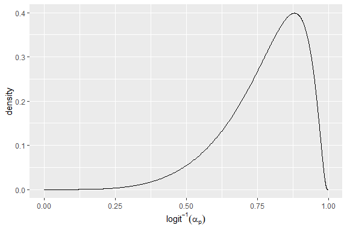

And, finally, our simulated draws from this prior on the probability
scale.

``` r
# plot it
ggplot(tibble(x = plogis(a_p)), 
        aes(x = x)) + 
  geom_histogram(binwidth = 0.05) + 
  ylab("number of draws from prior") + xlab(expression(paste(logit ^ -1, (alpha[p])))) +
  scale_x_continuous(limits = c(0, 1))
```

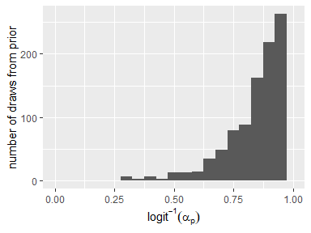

The prior for
,
which is the parameter determining the amount of site to site variation
in
.

``` r
# prior for scale parameter of varying site effects
loc_sigma_gamma_p = 0
scale_sigma_gamma_p = 0.1
sigma_gamma_p <- rtruncnorm(nsim, a = 0, mean = loc_sigma_gamma_p, sd = scale_sigma_gamma_p)
```

We’ve chosen the location parameter for the prior on

to be

and the scale parameter to be
.
Therefore, our prior is centered over
.
Along with the scale we’ve chosen, this prior places 90% of the density
of this standard deviation parameter between about 0.006 and 0.196.
Below is a visualization of the prior.

``` r
# plot it
ggplot(tibble(x = seq(0, 2, 0.01), 
              y = dtruncnorm(seq(0, 2, 0.01), 
                             a = 0, 
                             mean = loc_sigma_gamma_p, 
                             sd = scale_sigma_gamma_p)), 
        aes(x = x, y = y)) + 
  geom_line() + 
  ylab("density") + xlab(expression(sigma[gamma[p]]))
```

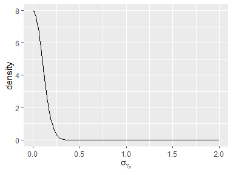

Here are our simulated draws for this prior on the probability scale.

``` r
# plot it
ggplot(tibble(x = sigma_gamma_p), 
        aes(x = x)) + 
  geom_histogram(binwidth = 0.05) + 
  ylab("number of draws from prior") + xlab(expression(sigma[gamma[p]])) +
  scale_x_continuous(limits = c(0, 2))
```

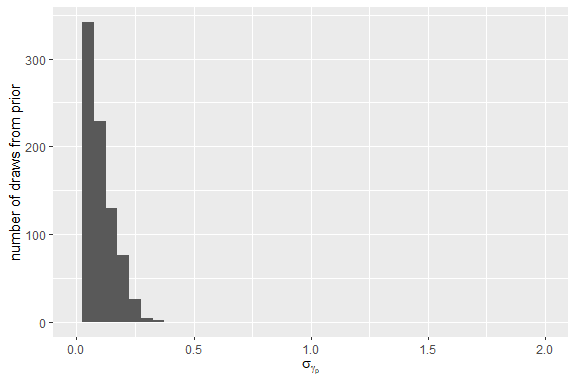

Next, the prior for
,
the parameter controlling the amount of day to day variation in the
probability of detection via qPCR conditional on it being available in
the water sample.

``` r
# prior for scale parameter of varying day effects
loc_sigma_delta_p = 0
scale_sigma_delta_p = 0.10
sigma_delta_p <- rtruncnorm(nsim, a = 0, mean = loc_sigma_delta_p, sd = scale_sigma_delta_p)
```

We’ve chosen the location parameter for the prior on

to be

and the scale parameter to be
.
Our prior places most of the probability over
.
Along with the scale we’ve chosen, this prior places 90% of the density
of this standard deviation parameter between about 0.006 and 0.196.
Below is a visualization of the prior.

``` r
# plot it
ggplot(tibble(x = seq(0, 2, 0.01), 
              y = dtruncnorm(seq(0, 2, 0.01), 
                             a = 0, 
                             mean = loc_sigma_delta_p, 
                             sd = scale_sigma_delta_p)), 
        aes(x = x, y = y)) + 
  geom_line() + 
  ylab("density") + xlab(expression(sigma[delta[p]]))
```


Here are our simulated draws for this prior on the probability scale.

``` r
# plot it
ggplot(tibble(x = sigma_delta_p), 
        aes(x = x)) + 
  geom_histogram(binwidth = 0.05) + 
  ylab("number of draws from prior") + xlab(expression(sigma[delta[p]])) +
  scale_x_continuous(limits = c(0, 2))
```

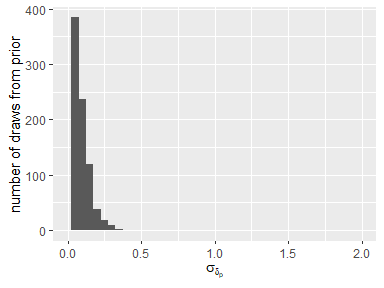

The last parameter that needs a prior for the

portion of the model is
,
which is the parameter controlling the amount of “spatio-temporal”
variation.

``` r
# prior for scale parameter of varying site effects
loc_sigma_nu_p = 0
scale_sigma_nu_p = 0.05
sigma_nu_p <- rtruncnorm(nsim, a = 0, mean = loc_sigma_nu_p, sd = scale_sigma_nu_p)
```

We’ve chosen the location parameter for the prior on

to be

and the scale parameter to be
.
Our prior places most of the probability over
.
Along with the scale we’ve chosen, this prior places 90% of the density
of this standard deviation parameter between about 0.003 and 0.098.
Below is a visualization of the prior.

``` r
# plot it
ggplot(tibble(x = seq(0, 2, 0.01), 
              y = dtruncnorm(seq(0, 2, 0.01), 
                             a = 0, 
                             mean = loc_sigma_nu_p, 
                             sd = scale_sigma_nu_p)), 
        aes(x = x, y = y)) + 
  geom_line() + 
  ylab("density") + xlab(expression(sigma[nu[p]]))
```

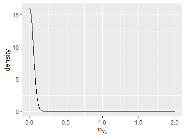

Here are our simulated draws for this prior on the probability scale.

``` r
# plot it
ggplot(tibble(x = sigma_nu_p), 
        aes(x = x)) + 
  geom_histogram(binwidth = 0.05) + 
  ylab("number of draws from prior") + xlab(expression(sigma[nu[p]])) +
  scale_x_continuous(limits = c(0, 2))
```

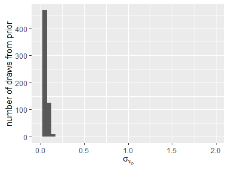

## 2.3 Simulate draws

Now we can actually simulate draws from the joint prior predictive
distribution. We’ll use our draws from the priors above above and then
push forward or loop through the likelihood.

``` r
# Simulate varying effects
gamma_psi <- array(NA, dim = c(nsite, nsim))
delta_psi <- array(NA, dim = c(ntime, nsim))
nu_psi <- array(NA, dim = c(nsite, ntime, nsim))

gamma_theta <- array(NA, dim = c(nsite, nsim))
delta_theta <- array(NA, dim = c(ntime, nsim))
nu_theta <- array(NA, dim = c(nsite, ntime, nsim))

gamma_p <- array(NA, dim = c(nsite, nsim))
delta_p <- array(NA, dim = c(ntime, nsim))
nu_p <- array(NA, dim = c(nsite, ntime, nsim))

for (i in 1:nsite){
  gamma_psi[i, ] <- rnorm(nsim, mean = 0, sd = sigma_gamma_psi)
  gamma_theta[i, ] <- rnorm(nsim, mean = 0, sd = sigma_gamma_theta)
  gamma_p[i, ] <- rnorm(nsim, mean = 0, sd = sigma_gamma_p)
}

for (t in 1:ntime){
  delta_psi[t, ] <- rnorm(nsim, mean = 0, sd = sigma_delta_psi)
  delta_theta[t, ] <- rnorm(nsim, mean = 0, sd = sigma_delta_theta)
  delta_p[t, ] <- rnorm(nsim, mean = 0, sd = sigma_delta_p)
}

for (i in 1:nsite){
  for (t in 1:ntime){
    nu_psi[i, t, ] <- rnorm(nsim, mean = 0, sd = sigma_nu_psi)
    nu_theta[i, t, ] <- rnorm(nsim, mean = 0, sd = sigma_nu_theta)
    nu_p[i, t, ] <- rnorm(nsim, mean = 0, sd = sigma_nu_p)
  }
}

# Run the prior predictive simulation through likelihood
for (i in 1:nsite) {
  for (t in 1:ntime) {
    psi_it[i, t, ] <- plogis(a_psi + gamma_psi[i, ] + delta_psi[t, ], + nu_psi[i, t, ]) # back-transform
    z_it[i, t, ] <- rbinom(nsim, 1, psi_it[i, t, ])
  
  for (j in 1:nsamp) {
    theta_ijt[i, j, t, ] <- plogis(a_theta + gamma_theta[i, ] + delta_theta[t, ] + nu_theta[i, t, ]) 
    a_ijt[i, j, t, ] <- rbinom(nsim, 1, z_it[i, t, ] * theta_ijt[i, j, t, ])
   
    for (k in 1:nrep) {
      p_ijkt[i, j, k, t, ] <- plogis(a_p + gamma_p[i, ] + delta_p[t, ] + nu_p[i, t, ])
      y_ijkt[i, j, k, t, ] <- rbinom(nsim, 1, a_ijt[ i, j, t, ] * p_ijkt[ i, j, k, t, ])
      }
    }
  }
}
```

### 2.3.1 Freqency of occupancy

We can then use these draws from the prior predictive distribution to
examine some of the practical implications of our priors and the model.
For example, we can plot the prior predictive distribution of the number
of days the sampling site is expected to be occupied.

``` r
plot_list <- vector(mode = "list", length = nsite)

for (i in 1:nsite){
  plot_list[[i]] <- local({
    i <- i
    pl <- qplot(apply(z_it[i, , ], 2, sum), binwidth = 1) + 
      scale_x_continuous(breaks = c(0, 5, 10, 15), minor_breaks = seq(0, 17, 1)) +
      ggtitle(paste0("Site:", i)) +
      theme(plot.title = element_text(size = 8)) +
      theme(axis.title.x = element_blank()) +
      theme(axis.title.y = element_blank())
  })
}

grid.arrange(grobs = plot_list, 
             top = "Number of days occupied for each site",
             left = paste0("Number of simulations (", nsim, "\ possible)"),
             bottom = paste0("Number of \"occupied\" days (", ntime, "\ ", "possible)"))
```

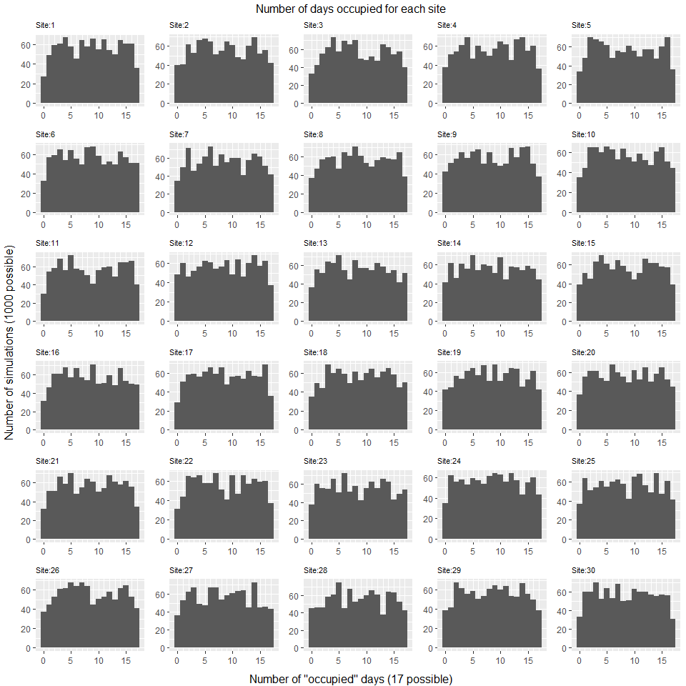

Or the number of sites occupied on any particular day.

``` r
plot_list <- vector(mode = "list", length = ntime)

for (t in 1:ntime){
  plot_list[[t]] <- local({
    t <- t
    pl <- qplot(apply(z_it[, t, ], 2, sum), binwidth = 1) + 
      scale_x_continuous(breaks = seq(0, 30, 5)) +
      ggtitle(paste0("Day:", t)) +
      theme(plot.title = element_text(size = 8)) +
      theme(axis.title.x = element_blank()) +
      theme(axis.title.y = element_blank())
  })
}

grid.arrange(grobs = plot_list,
             ncol = 4,
             top = "Number of sites occupied for each day",
             left = paste0("Number of simulations (", nsim, "\ possible)"),
             bottom = paste0("Number of \"occupied\" sites (", nsite, "\ ", "possible)"))
```

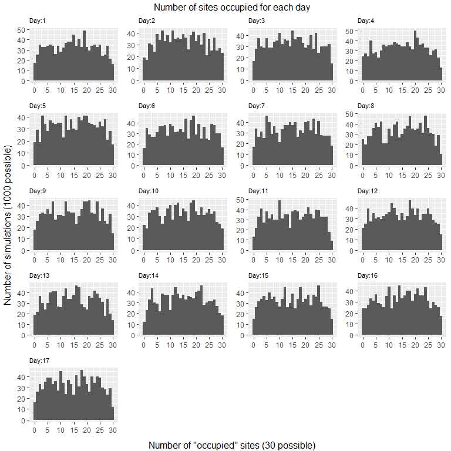

### 2.3.2 Frequency of detections

Or we can plot the prior predictive distribution of the total number of
qPCR runs returning a positive result (out of 1.02^{4} possible for each
simulation).

``` r
qplot(x = apply( y_ijkt, 5, sum ) / (nsite * ntime * nsamp * nrep), binwidth = 0.01) + 
  expand_limits( x = c( 0, 1 ) ) +
  xlab(paste0("Proportion of\ " , nsite * ntime * nsamp * nrep, "\ total PCR samples as positive detections")) +
  ylab(paste0("Number of simulations (", nsim, "\ possible)" ))
```

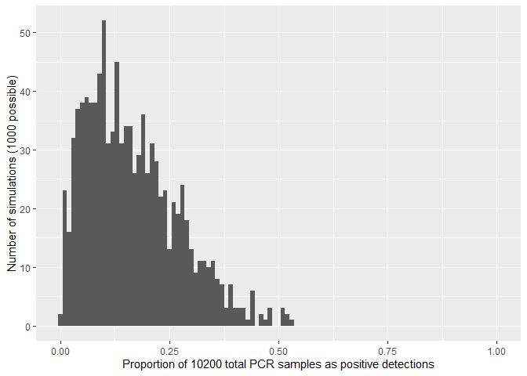

### 2.3.3 Replicate datasets

We could look at it another way by, say, visualizing replicated
hypothetical datasets from the prior predictive distribution. Lets draw
several replicate ‘datasets’ at random from the prior predictive
distribution for the first date and plot them.

``` r
n_yrep <- 20 # number of replicate datasest to draw
sim_draw <- sample(1:nsim, n_yrep, replace = F) # assign random draw

psi_rep <- psi_it[, 1, sim_draw] # psi for datasets drawn
theta_rep <- theta_ijt[, , 1, sim_draw] # theta for datasets drawn
p_rep <- p_ijkt[, , , 1, sim_draw] # p for datasets drawn
y_rep <- y_ijkt[, , , 1, sim_draw] # "oberved" y for each of the n_yrep datasets

# create empty list of dataframes to store y_rep data in frequency of pcr detects format
y_rep_freq <- vector('list', n_yrep)

# draw sample of datasets and re-format for plot
for( i in 1:n_yrep ){
 y_rep_freq[[i]] <- data.frame(t(apply(y_rep[, , , i], 1, rowSums))) %>%
  gather(variable, value) %>%
  mutate(samples = rep(seq(1, nsamp, 1), nsite)) %>%
  rename(day = variable, 
          pcr_detects = value,
          water_rep = samples) %>%
  mutate(day = rep(seq(1, nsite, 1), each = nsamp))
}

# build a plot function and color palette
myfill <- colorRampPalette(rev(brewer.pal(nrep, "Spectral")))


plot_yrep <- function(data, rep){
  ggplot(data[[ rep ]], aes(x = water_rep, y = day, size = pcr_detects, color = pcr_detects)) + 
    theme_bw() +
    geom_point(alpha = 0.6) + 
    scale_size_identity("PCR detects") + 
    scale_fill_gradientn(colours = myfill) +
    scale_x_discrete("Water sample", limits = factor(seq(1, nsamp, 1))) + 
    scale_y_discrete("Site", limits = factor(seq(1, nsite, 1))) + 
    theme(axis.title.x = element_text(size=10, vjust=1),
           axis.title.y = element_text(size=10, vjust=1),
           axis.text.y = element_text(size=8, angle=360), 
           axis.text.x = element_text(angle=360, size=8, vjust=0.2),
           legend.position = "none",
           plot.title = element_text(size = 8, face = "bold")
           ) +
    ggtitle(bquote(list(psi == .(round(psi_rep[ 1, rep ], 2)),
                           theta == .(round( theta_rep[ 1, 1, rep ], 2)),
                           p == .(round(p_rep[ 1, 1, 1, rep ], 2)))))
 }

# make up dataset with all combinations for legend
y_rep_legend <- data.frame(day = rep(seq(1, nsite, 1), each = nsamp),
                            water_rep = rep(seq(1, nsamp, 1), nsite),
                            pcr_detects = sample(seq(0, nrep, 1), nsamp * nsite , replace = T))

# make fake plot with legend to extract
p_legend <- ggplot(y_rep_legend, aes(x = water_rep, y = day, size = pcr_detects, color = pcr_detects)) + 
  theme_bw() +
  geom_point(alpha = 0.6) + 
  scale_size_area(max_size = 4) + 
  scale_fill_gradientn(colours = myfill) +
  theme(legend.title = element_text( size=10),
        legend.text = element_text(size=10),
        legend.position = "top",
        legend.margin = margin(0, 0, 0, 0),
        legend.box.margin = margin(-10, 0, -10, -5)
        )

# fn to extract legend
get_legend <- function(myggplot){
  tmp <- ggplot_gtable(ggplot_build(myggplot))
  leg <- which(sapply(tmp$grobs, function(x) x$name) == "guide-box")
  legend <- tmp$grobs[[leg]]
  return(legend)
}

p_legend <- get_legend(p_legend)

plot_grid <- lapply(seq(1, n_yrep, 1), plot_yrep, data = y_rep_freq)

plot_out <- arrangeGrob( 
  p_legend,
  do.call(arrangeGrob, c(plot_grid, ncol = 5)),
  ncol = 1,
  nrow = 2,
  heights = c(0.04, 0.96))
```

Specically, we’ll plot 20 of them, along with the values of the
parameters they were generated from. Note that the parameters
(,
,
)
are fixed for each of the ‘datasets’ in the plot, but each of those
panels is only one probabilistic realization from the potential set
generated from that particular configuration of the parameters.

``` r
plot(plot_out)
```


It may be informative to generate multiple realizations from a single
configuration of the paramters. We’ll now try that by taking one of the
draws from the prior for the three parameters and plotting some
hypothetical datasets based on that configuration. Another way to think
of it might be to think of the prior for each parameter as just being a
point value (or very strong).

So, lets just take the last configuration of parameters from our
previous plot, where we have

0.6,

0.44, and

0.74.

``` r
n_y_i_rep <- 20 # number of replicate datasest to draw

# make containers
z_i_fix <- matrix(NA, ntime, n_y_i_rep)
a_ij_fix <- array(NA, dim = c(ntime, nsamp, n_y_i_rep))
y_rep_fix <- array(NA, dim = c(ntime, nsamp, nrep, n_y_i_rep))

# Run the prior predictive simulation
for (i in 1:ntime) {
  z_i_fix[i , ] <- rbinom(n_y_i_rep, 1, psi_it[ 1, 1, sim_draw[n_yrep]])
  
  for (j in 1:nsamp) {
    a_ij_fix[i, j, ] <- rbinom(n_y_i_rep, 1, z_i_fix[ i, ] * theta_ijt[ 1, 1, 1, sim_draw[n_yrep]])
   
    for (k in 1:nrep) {
      y_rep_fix[i, j, k, ] <- rbinom(n_y_i_rep, 1, a_ij_fix[i, j, ] * p_ijkt[1, 1, 1, 1, sim_draw[n_yrep]])
      }
    }
  }
# create empty list of dataframes to store y_rep data in frequency of pcr detects format
y_rep_freq <- vector('list', n_y_i_rep)

# draw sample of datasets and re-format for plot
for(i in 1:n_y_i_rep){
 y_rep_freq[[i]] <- data.frame(t(apply(y_rep_fix[, , , i], 1, rowSums))) %>%
  gather(variable, value) %>%
  mutate(samples = rep(seq(1, nsamp, 1), ntime)) %>%
  rename(day = variable, 
          pcr_detects = value,
          water_rep = samples) %>%
  mutate(day = rep(seq(1, ntime, 1), each = nsamp))
}

# build a plot function and color palette
myfill <- colorRampPalette(rev(brewer.pal(nrep, "Spectral")))


plot_yrep <- function(data, rep){
  ggplot(data[[rep]], aes(x = water_rep, y = day, size = pcr_detects, color = pcr_detects)) + 
    theme_bw() +
    geom_point(alpha = 0.6) + 
    scale_size_identity("PCR detects") + 
    scale_fill_gradientn(colours = myfill) +
    scale_x_discrete("Water sample", limits = factor(seq(1, nsamp, 1))) + 
    scale_y_discrete("Day", limits = factor(seq(1, ntime, 1))) + 
    theme( axis.title.x = element_text(size=10, vjust=1),
           axis.title.y = element_text(size=10, vjust=1),
           axis.text.y = element_text(size=8, angle=360), 
           axis.text.x = element_text(angle=360, size=8, vjust=0.2),
           legend.position = "none",
           plot.title = element_text(size = 8, face = "bold")
           ) +
    ggtitle(bquote(list(psi == .(round(psi_it[1, 1, sim_draw[n_yrep]], 2)),
                           theta == .(round(theta_ijt[1, 1, 1, sim_draw[n_yrep]], 2)),
                           p == .(round(p_ijkt[1, 1, 1, 1, sim_draw[n_yrep]], 2)))))
 }

# make up dataset with all combinations for legend
y_rep_legend <- data.frame(day = rep(seq(1, ntime, 1), each = nsamp),
                            water_rep = rep(seq(1, nsamp, 1), ntime),
                            pcr_detects = sample(seq(0, nrep, 1), nsamp * ntime , replace = T))

# make fake plot with legend to extract
p_legend <- ggplot(y_rep_legend, aes(x = water_rep, y = day, size = pcr_detects, color = pcr_detects)) + 
  theme_bw() +
  geom_point(alpha = 0.6) + 
  scale_size_area(max_size = 4) + 
  scale_fill_gradientn(colours = myfill) +
  theme(legend.title = element_text(size=10),
        legend.text = element_text(size=10),
        legend.position = "top",
        legend.margin = margin(0, 0, 0, 0),
        legend.box.margin = margin(-10, 0, -10, -5)
        )

# fn to extract legend
get_legend <- function(myggplot){
  tmp <- ggplot_gtable(ggplot_build(myggplot))
  leg <- which(sapply(tmp$grobs, function(x) x$name) == "guide-box")
  legend <- tmp$grobs[[leg]]
  return(legend)
}

p_legend <- get_legend(p_legend)

plot_grid <- lapply(seq(1, n_y_i_rep, 1), plot_yrep, data = y_rep_freq)

plot_out <- arrangeGrob( 
  p_legend,
  do.call(arrangeGrob, c(plot_grid, ncol = 5)),
  ncol = 1,
  nrow = 2,
  heights = c(0.04, 0.96))
```

``` r
plot(plot_out)
```

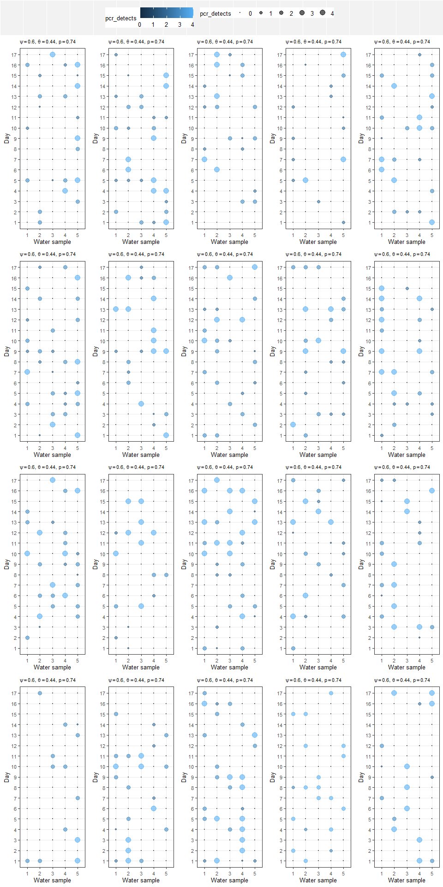

# 3 A model in Stan

Now let use this model simulation to check our computational algorithm
that we would use for Bayesian inference given real data (i.e., Stan).
We’ll code the Stan model, then we’ll select a “dataset” from the
simulation above and see if our Stan program recovers the known
parameters.

We’ll first code up our Stan model.

## 3.1 Stan code

Thanks to Maxwell Jospeph for providing the first marginalized version
of a multilevel occupancy model useable with Stan that I came across at:

<https://discourse.mc-stan.org/t/divergent-transition-every-iteration-multi-scale-occupancy-model/13739>

``` stan
data {
  int< lower = 1 > ndate;
  int< lower = 1 > nsamp;
  int< lower = 1 > nrep;
  int< lower = 0, upper = 1 > y[ndate, nsamp, nrep];
  int< lower = 1 > n_possible;
  matrix< lower = 0, upper = 1 >[n_possible, nsamp] alpha_potential;
}

transformed data {
  int<lower = 0, upper = 1> known_present[ndate];
  int<lower = 0, upper = 1> known_available[ndate, nsamp];
  for (i in 1:ndate) {
    known_present[i] = 0;
    for (j in 1:nsamp) {
      known_available[i, j] = 0;
      for (k in 1:nrep) {
        if (y[i, j, k] == 1) {
         known_present[i] = 1;
         known_available[i, j] = 1;
        }
      }
    }
  }
}

parameters {
  real a_psi ;
  real a_theta;
  real a_p;
}

transformed parameters {
  vector[ndate] log_lik;
  real<lower = 0, upper = 1> psi[ndate];
  real<lower = 0, upper = 1> theta[ndate, nsamp];
  real<lower = 0, upper = 1> p[ndate, nsamp, nrep];
  
  // linear predictor
  for(i in 1:ndate){
    psi[i] = inv_logit(a_psi); // linear predictor (logit scale) for psi
    for (j in 1:nsamp){
      theta[i, j] = inv_logit(a_theta); // linear predictor (logit scale) for theta
      for( k in 1:nrep ){
        p[i, j, k] = inv_logit(a_p); // linear predictor (logit scale) for p
        } // k
      } // j
    } // i
  
  {
    vector[nsamp] tmp_lp;
    matrix[n_possible, nsamp] tmp_poss;
    vector[n_possible + 1] sum_poss;
    
    for (i in 1:ndate) {
      if (known_present[i]) {
        for (j in 1:nsamp) {
           if (known_available[i, j]) {
             // present in site and available for water sample
             tmp_lp[j] = log(theta[i, j]) + bernoulli_lpmf(y[i, j, ] | p[i, j, ]);
          
             } else {
               // present, possibly unavailable for water sample
               tmp_lp[j] = log_sum_exp(
                 log(theta[i, j]) + bernoulli_lpmf(y[i, j, ] | p[i, j, ]), 
                 log1m(theta[i, j ])
                 );
               }
        } // j( 1 )
        log_lik[i] = log(psi[i]) + sum(tmp_lp);
      } else {
        // could be present or absent (was never detected)
        // and there are 2^ntime possible combinations
        // of alpha_{i, j} that are relevant if z_i = 1
        for (jj in 1:n_possible) {
          for (j in 1:nsamp) {
            if (alpha_potential[jj, j] == 0) {
              // not available
              tmp_poss[jj, j] = log1m(theta[i, j ]);
            } else {
              // available but not detected
              tmp_poss[jj, j] = log(theta[i , j]) + bernoulli_lpmf(y[i, j, ] | p[i, j, ]);
            }
          }
          sum_poss[jj] = log(psi[i]) + sum(tmp_poss[jj, ]);
        } // j( 2 )
        sum_poss[n_possible + 1] = log1m(psi[i]);
        log_lik[i] = log_sum_exp(sum_poss);
      }
    } // i
  }
}

model {
  // priors
  target += normal_lpdf(a_psi | -3, 1);
  target += normal_lpdf(a_theta | -1, 1);
  target += normal_lpdf(a_p | 1, 1);
  
  // add likelihood
  target += sum(log_lik);
}
```

## 3.2 Pick fake dataset for Stan

Lets just pick the last dataset from the simulation with known
parameters above. We have to creat a variable called ‘alpha_potential’
to account for all the potential combinations of

that could lead to an all-zero observation history. This is in order to
integrate out the latent discrete parameters (i.e.,
,
and
)
for our Stan program because Stan doesn’t allow discrete paramters. This
marginalization is actually optimal even in BUGS, but we’ll save the
explanation for later.

In any case, we also create a data list for our Stan program.

``` r
# potential combinations of alpha that can lead to all-zero capture history
alpha_potential <- expand.grid(rep(list(c(0, 1)), nsamp))

stan_d <- list(ndate = ntime, 
               nsamp = nsamp, 
               nrep = nrep, 
               y = y_rep_fix[, , , 1], 
               n_possible = 2 ^ nsamp, 
               alpha_potential = alpha_potential)

#print( stan_d )
```

## 3.3 Fit Stan model

Now we can fit the model to the data with Stan in R.

``` r
fit_mod1 <- sampling(
  object = mocc,
  data = stan_d,
  chains = 4,
  iter = 2000,
  cores = 4,
  thin = 1
  )
```

## 3.4 Print posterior summary

And we’ll print the posterior estimates. Note the indexing on “psi”,
“theta” and “p”, We chose just the first index for each of these because
all the others are the same due to this being an “intercept only” model.
With a more complex linear predictor, each of these parameters could
vary among sites, samples and/or reps; and in that case we might choose
to print more dimensions. More likely, though, we’d be more interested
in the logit scale parameters in that case. Nevertheless, for this
simpler model we’ll print both the logit scale intercept parameters and
each of
,
,
and
.

``` r
print(fit_mod1, 
       pars = c("a_psi", "a_theta", "a_p", "psi[1]", "theta[1,1]", "p[1,1,1]"), 
       digits_summary = 3)
```

    ## Inference for Stan model: anon_model.
    ## 4 chains, each with iter=2000; warmup=1000; thin=1; 
    ## post-warmup draws per chain=1000, total post-warmup draws=4000.
    ## 
    ##              mean se_mean    sd   2.5%    25%    50%    75% 97.5% n_eff  Rhat
    ## a_psi      -0.443   0.008 0.477 -1.416 -0.757 -0.438 -0.120 0.486  3630 1.000
    ## a_theta    -0.151   0.004 0.295 -0.732 -0.347 -0.150  0.051 0.431  4727 1.000
    ## a_p         0.860   0.004 0.241  0.392  0.694  0.857  1.025 1.329  3747 1.001
    ## psi[1]      0.397   0.002 0.108  0.195  0.319  0.392  0.470 0.619  3705 1.000
    ## theta[1,1]  0.463   0.001 0.072  0.325  0.414  0.463  0.513 0.606  4750 1.000
    ## p[1,1,1]    0.700   0.001 0.050  0.597  0.667  0.702  0.736 0.791  3767 1.001
    ## 
    ## Samples were drawn using NUTS(diag_e) at Wed Mar  5 10:57:48 2025.
    ## For each parameter, n_eff is a crude measure of effective sample size,
    ## and Rhat is the potential scale reduction factor on split chains (at 
    ## convergence, Rhat=1).

We can also plot the posteriors and overlay the known parameters to
assess recovery.

``` r
#first extract posteriors
posteriors_fit <- rstan::extract(fit_mod1)

#plot
qplot(x = posteriors_fit$psi[ ,1], geom = 'histogram', binwidth = 0.01) +
  geom_vline(xintercept = psi_it[1, 1, sim_draw[n_yrep]], color = 'red', size = 2) +
  xlab(expression( psi ) )
```

    ## Warning: Using `size` aesthetic for lines was deprecated in ggplot2 3.4.0.
    ## ℹ Please use `linewidth` instead.
    ## This warning is displayed once every 8 hours.
    ## Call `lifecycle::last_lifecycle_warnings()` to see where this warning was
    ## generated.

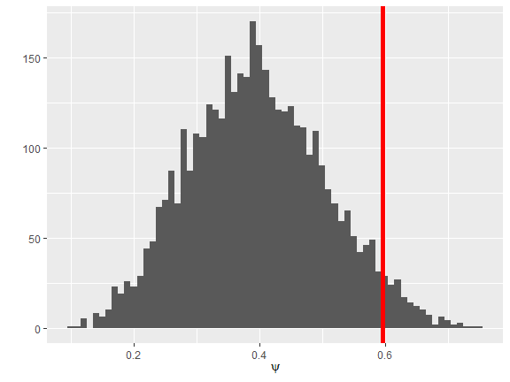

``` r
qplot(x = posteriors_fit$theta[ ,1 ,1], geom = 'histogram', binwidth = 0.01 ) +
  geom_vline(xintercept = theta_ijt[1, 1, 1, sim_draw[n_yrep]], color = 'red', size = 2) +
  xlab(expression(theta))
```

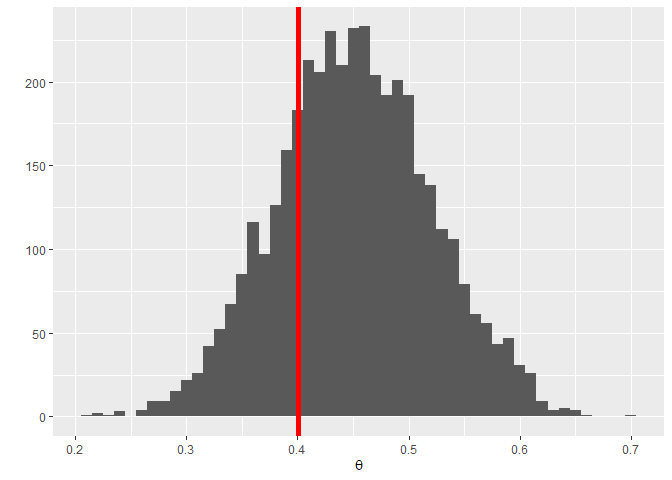

``` r
qplot(x = posteriors_fit$p[ , 1, 1 , 1], geom = 'histogram', binwidth = 0.01) +
  geom_vline(xintercept = p_ijkt[1, 1, 1, 1, sim_draw[n_yrep]], color = 'red', size = 2) +
  xlab(expression(p))
```

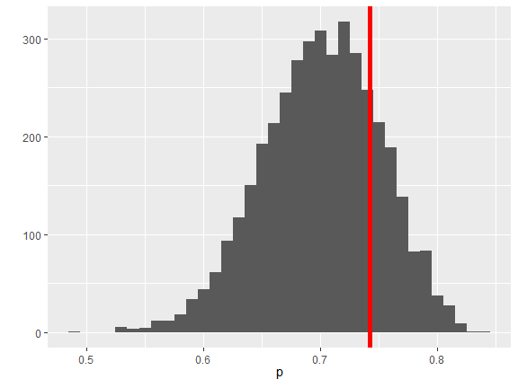

# 4 Session info

``` r
sessionInfo()
```

    ## R version 4.4.1 (2024-06-14 ucrt)
    ## Platform: x86_64-w64-mingw32/x64
    ## Running under: Windows 11 x64 (build 22631)
    ## 
    ## Matrix products: default
    ## 
    ## 
    ## locale:
    ## [1] LC_COLLATE=English_United States.utf8 
    ## [2] LC_CTYPE=English_United States.utf8   
    ## [3] LC_MONETARY=English_United States.utf8
    ## [4] LC_NUMERIC=C                          
    ## [5] LC_TIME=English_United States.utf8    
    ## 
    ## time zone: America/New_York
    ## tzcode source: internal
    ## 
    ## attached base packages:
    ## [1] stats     graphics  grDevices utils     datasets  methods   base     
    ## 
    ## other attached packages:
    ##  [1] tidybayes_3.0.7     bayesplot_1.11.1    loo_2.8.0          
    ##  [4] rstan_2.32.6        StanHeaders_2.32.10 lubridate_1.9.3    
    ##  [7] forcats_1.0.0       dplyr_1.1.4         purrr_1.0.2        
    ## [10] readr_2.1.5         tidyr_1.3.1         tibble_3.2.1       
    ## [13] tidyverse_2.0.0     stringr_1.5.1       truncnorm_1.0-9    
    ## [16] RColorBrewer_1.1-3  gridExtra_2.3       ggExtra_0.10.1     
    ## [19] ggplot2_3.5.1      
    ## 
    ## loaded via a namespace (and not attached):
    ##  [1] tensorA_0.36.2.1     gtable_0.3.5         xfun_0.47           
    ##  [4] QuickJSR_1.4.0       lattice_0.22-6       inline_0.3.19       
    ##  [7] tzdb_0.4.0           vctrs_0.6.5          tools_4.4.1         
    ## [10] generics_0.1.3       stats4_4.4.1         parallel_4.4.1      
    ## [13] fansi_1.0.6          highr_0.11           pkgconfig_2.0.3     
    ## [16] checkmate_2.3.2      distributional_0.5.0 RcppParallel_5.1.9  
    ## [19] lifecycle_1.0.4      farver_2.1.2         compiler_4.4.1      
    ## [22] munsell_0.5.1        codetools_0.2-20     httpuv_1.6.15       
    ## [25] htmltools_0.5.8.1    yaml_2.3.10          crayon_1.5.3        
    ## [28] later_1.3.2          pillar_1.9.0         arrayhelpers_1.1-0  
    ## [31] abind_1.4-8          mime_0.12            posterior_1.6.0     
    ## [34] tidyselect_1.2.1     digest_0.6.37        svUnit_1.0.6        
    ## [37] stringi_1.8.4        labeling_0.4.3       fastmap_1.2.0       
    ## [40] grid_4.4.1           colorspace_2.1-1     cli_3.6.3           
    ## [43] magrittr_2.0.3       pkgbuild_1.4.4       utf8_1.2.4          
    ## [46] withr_3.0.1          scales_1.3.0         promises_1.3.0      
    ## [49] backports_1.5.0      timechange_0.3.0     rmarkdown_2.28      
    ## [52] matrixStats_1.4.1    hms_1.1.3            coda_0.19-4.1       
    ## [55] shiny_1.9.1          evaluate_0.24.0      knitr_1.48          
    ## [58] ggdist_3.3.2         miniUI_0.1.1.1       rlang_1.1.4         
    ## [61] Rcpp_1.0.13          xtable_1.8-4         glue_1.7.0          
    ## [64] rstudioapi_0.16.0    R6_2.5.1

# 5 References

<div id="refs" class="references csl-bib-body hanging-indent"
entry-spacing="0">

<div id="ref-Nichols_etal_2008" class="csl-entry">

Nichols, James D., Larissa L. Bailey, Allan F. O’Connell Jr., Neil W.
Talancy, Evan H. Campbell Grant, Andrew T. Gilbert, Elizabeth M. Annand,
Thomas P. Husband, and James E. Hines. 2008. “Multi-Scale Occupancy
Estimation and Modelling Using Multiple Detection Methods.” *Journal of
Applied Ecology* 45 (5): 1321–29.
https://doi.org/<https://doi.org/10.1111/j.1365-2664.2008.01509.x>.

</div>

<div id="ref-Schmidt_etal_2013" class="csl-entry">

Schmidt, Benedikt R., Marc Kéry, Sylvain Ursenbacher, Oliver J. Hyman,
and James P. Collins. 2013. “Site Occupancy Models in the Analysis of
Environmental DNA Presence/Absence Surveys: A Case Study of an Emerging
Amphibian Pathogen.” *Methods in Ecology and Evolution* 4 (7): 646–53.
https://doi.org/<https://doi.org/10.1111/2041-210X.12052>.

</div>

</div>
